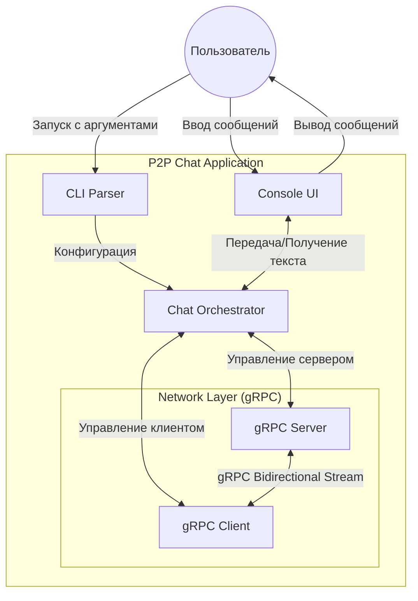
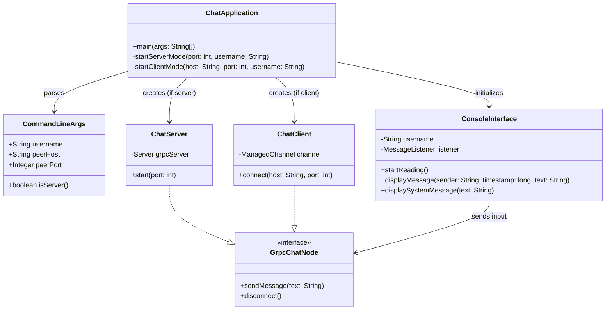

# Архитектура P2P чата CliChat

## 1. Требования к приложению

Что мы реализуем в рамках задания:
1. **Режимы работы:** Приложение умеет быть и сервером (ждет подключений), и клиентом (подключается к другому пиру).
2. **Запуск:** При старте обязательно указываем свое имя (`--username`). Если хотим к кому-то подключиться, передаем адрес и порт (`--peer`, `--port`). Если адрес не передали, просто запускаемся как сервер и ждем собеседника.
3. **Сеть:** Соединение устанавливается напрямую (peer-to-peer). Сообщения можно отправлять и получать в любой момент времени асинхронно.
4. **Интерфейс:** Обычная консоль.
5. **Формат сообщений:** При выводе на экран сообщение должно содержать имя отправителя, время и сам текст. Примерно так: `[2026-03-30 15:45:00] Alice: Привет!`.

---

## 2. Выбор технологий

* **Язык:** `Java 21`. Мы выбрали Java, потому что в ней удобно работать с многопоточностью (нам нужно одновременно слушать сеть и читать ввод с клавиатуры), плюс мы с ней хорошо знакомы. Для thread-safety используем `AtomicReference` при работе с gRPC stream observers, что предотвращает race conditions.

* **Сетевой протокол:** `gRPC` с Bidirectional Streaming. Как и рекомендовалось в задании, решили взять его. Механизм `rpc ChatStream (stream ChatMessage) returns (stream ChatMessage)` идеально подходит для P2P чата: обе стороны могут отправлять сообщения асинхронно без ожидания ответа, при этом используется одно TCP-соединение. Настроили keep-alive (30s) для автоматического обнаружения разорванных соединений и connection timeout (10s), чтобы клиент не висел бесконечно при недоступном сервере.

* **Сборка:** `Gradle`. С ним проще всего настроить генерацию gRPC-классов из `.proto` файлов и прикрутить CI/CD.

* **Тесты:** `JUnit 5` для unit и интеграционных тестов. Интеграционные тесты запускают реальный сервер и клиент, проверяя взаимодействие через gRPC.

* **Диаграммы:** `Mermaid.js`, чтобы хранить схемы прямо в Markdown-файле, и они красиво отображались на GitHub/GitLab.

---

## 3. Диаграммы

### 3.1. Диаграмма компонент

**Ответственность компонент:**
* **CLI Parser:** Читает аргументы при запуске и понимает, кто мы — сервер или клиент.

* **Console UI:** Крутится в отдельном daemon-потоке, чтобы не блокировать главный поток. Ждет ввод с клавиатуры и красиво выводит сообщения с форматированием: `[DD.MM.YYYY HH:MM:SS] Имя: Текст`. Поддерживает команду `/exit` для корректного завершения.

* **Chat Orchestrator:** Главный класс, который связывает интерфейс и сеть.

* **Network Layer:** Вся работа с gRPC. Сервер принимает только одно подключение (используя атомарный `compareAndSet` для отклонения повторных подключений). При завершении вызывается graceful shutdown с `awaitTermination()` (таймаут 5 секунд), чтобы все сообщения успели отправиться.

### 3.2. Диаграмма классов

**Кратко по классам:**
* `ChatApplication`: Точка входа в программу. Парсит аргументы и запускает либо сервер, либо клиент.

* `CommandLineArgs`: Простой класс, где лежат распарсенные аргументы запуска. Метод `isServer()` возвращает `true`, если peer/port не указаны.

* `ConsoleInterface`: Отвечает за консоль. Метод `startReading()` запускает daemon-поток, который бесконечно ждет ввода. Пустые сообщения игнорируются. Timestamp конвертируется из Unix миллисекунд в локальное время.

* `GrpcChatNode`: Общий интерфейс. Интерфейсу (UI) не нужно знать, сервер мы сейчас или клиент — он просто вызывает `sendMessage()`.

* `ChatServer` и `ChatClient`: Сама реализация сети под капотом gRPC. Используют `AtomicReference<StreamObserver>` для thread-safe доступа из разных потоков (UI и gRPC). Сервер отклоняет множественные подключения. Клиент настроен с timeout'ами для надежности.

---

## 4. Распределение задач

Чтобы не мешать друг другу и не ловить постоянные конфликты при слиянии веток, мы разделили работу на две независимые части.

### Алина (Сеть и инфраструктура)
* Настройка пустого проекта, `build.gradle`, добавление плагинов для gRPC.
* Настройка линтера (Checkstyle) и CI/CD (GitHub Actions), чтобы код проверялся автоматически при пуше.
* Написание `chat.proto` (описание того, как будут выглядеть сообщения на уровне сети).
* Реализация `ChatServer` и `ChatClient` (вся логика gRPC).

### Соня (Логика, консоль и тесты)
* Парсинг аргументов командной строки.
* Написание `ConsoleInterface` (чтение с клавиатуры в отдельном потоке, форматирование времени и имени).
* Связка всего вместе в `ChatApplication`.
* Написание юнит-тестов и плана тестирования.

### Что делаем вместе
* Ревьюим код друг друга в Pull Request'ах.
* Пишем документацию (этот файл и README).
* Интеграционное тестирование: запускаем реальный сервер и клиент, проверяем обмен сообщениями, корректное отключение, обработку ошибок и граничные случаи (например, попытка множественного подключения).
